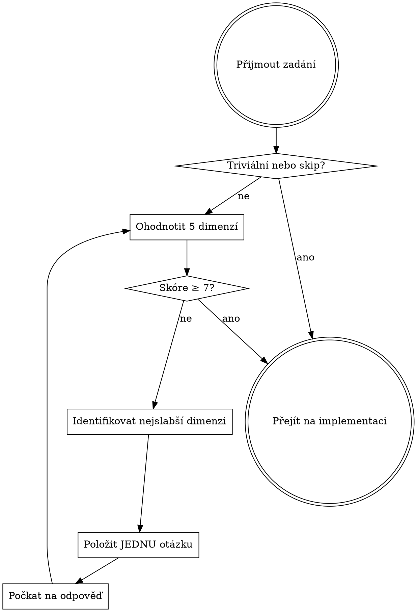

# Check Task Specificity

## Overview

Vágní zadání = špatný výsledek. Tento skill hodnotí specifičnost zadání dle 5 dimenzí identifikovaných výzkumem (arxiv 2504.20196) a klade cílené otázky dokud není zadání dostatečně konkrétní.

## Kdy přeskočit

**Přeskočit pokud:**
- Triviální úkol: oprava překlepu, jednořádková změna, přejmenování
- Uživatel explicitně říká "prostě to udělej" / "just do it"
- Odpověď na dotaz (ne implementace)
- Refaktoring s jasným before/after příkladem

**Vždy kontrolovat:**
- Nová funkce nebo komponenta
- Oprava bugu bez reprodukčních kroků
- "Přidej X do Y" bez kontextu
- Jakékoli zadání ≥ 3 soubory nebo ≥ 30 minut práce

## 5 Dimenzí hodnocení

| # | Dimenze | Co kontroluje | Příznaky chybění |
|---|---------|--------------|-----------------|
| 1 | **Záměr uživatele** (User Intent) | Je cíl jasně vyjádřen? Co vývojář chce dosáhnout? | "oprav to", "zlepši", "udělej to lepší" |
| 2 | **Specifika** (Specifics) | Jsou uvedeny konkrétní detaily — názvy, hodnoty, typy, API? | Žádná konkrétní jména tříd/metod/proměnných |
| 3 | **Operační plán** (Operationalization Plan) | Je specifikováno JAK implementovat? Který přístup, funkce, vzor? | Existuje více platných přístupů a žádný není vybrán |
| 4 | **Lokalizace/Rozsah** (Localization/Scope) | Kde přesně a jak rozsáhlé změny? Konkrétní soubory, řádky, bloky? | Nejasné zda jedna instance nebo všechny výskyty |
| 5 | **Kontext kódu** (Codebase Context) | Jsou zmíněny relevantní konvence, existující knihovny, architektura? | LLM musí hádat projekt-specifické věci |

## Scoring

Každá dimenze: **0** (chybí) / **1** (částečně) / **2** (kompletní) → celkem 0–10 bodů

| Skóre | Akce |
|-------|------|
| ≥ 7 | Přejít na implementaci |
| 5–6 | Položit otázku pro nejslabší dimenzi |
| ≤ 4 | Příliš vágní — povinně klást otázky |

## Workflow

## Pravidla kladení otázek

- Klást vždy **jen jednu otázku** — na nejslabší dimenzi
- Otázka musí být **konkrétní** (ne "řekni mi víc")
- Po odpovědi **znovu ohodnotit** — neklást všechny otázky najednou
- **Nezačínat implementaci** dokud skóre < 7

## Příklady otázek dle dimenze

| Dimenze | Příklad otázky |
|---------|----------------|
| Záměr uživatele | "Co přesně má být výsledkem? Nová komponenta, úprava existující, nebo refaktoring?" |
| Specifika | "Jaké konkrétní třídy/metody/hodnoty jsou zapojeny? Máš preferovaný název?" |
| Operační plán | "Existuje preferovaný přístup? Např. přes middleware, event handler, nebo přímo v komponentě?" |
| Lokalizace/Rozsah | "V jakém souboru nebo komponentě? Má se změna týkat jednoho místa nebo všech výskytů?" |
| Kontext kódu | "Jsou nějaké projektové konvence nebo existující knihovny které mám použít?" |

## Červené vlajky (racionalizace které je třeba ignorovat)

| Myšlenka | Realita |
|----------|---------|
| "Asi vím co tím myslí" | Dohad ≠ znalost. Zeptej se. |
| "Zjistím co chce při implementaci" | Pozdní zjištění = přepracování. |
| "Je to přece jasné" | Jasné tobě ≠ jasný záměr uživatele. |
| "Nechci zdržovat otázkami" | Zdržení 1 min > přepracování 30 min. |
| "Zadání je dost specifické" | Ohodnoť dle 5 dimenzí, ne pocitem. |
| "Operační plán si vymyslím sám" | Existuje-li více platných přístupů, uživatel má právo vybrat. |

## Common Mistakes

| Chyba | Důsledek |
|-------|----------|
| Kladení všech otázek najednou | Uživatel je zahlcen, odpovídá vágně |
| Přeskočení skillu u "zdánlivě jasných" zadání | Implementace špatné věci |
| Ignorování dimenze Operační plán | Výběr špatného přístupu z více platných |
| Přidávání předpokladů místo otázky | Implementace na základě domněnek |
